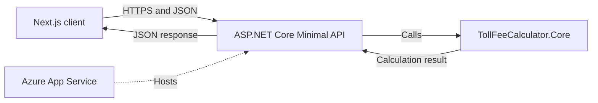

# Gothenburg Toll Fee Calculator

A full-stack toll fee calculator based on the Gothenburg congestion tax rules for 2013.

The project began as a C# refactoring work sample and has been extended with:

- A separated domain and business-logic project
- An ASP.NET Core Minimal API
- Unit and API integration tests
- A Next.js frontend
- An animated visualization of vehicle passages
- Deployment to Microsoft Azure App Service
- A public health endpoint

## Live API

The API is deployed to Microsoft Azure App Service:

```text
https://rasti-toll-calculator-api.azurewebsites.net
```

Health check:

```text
https://rasti-toll-calculator-api.azurewebsites.net/health
```

Toll calculation endpoint:

```text
POST https://rasti-toll-calculator-api.azurewebsites.net/api/toll/calculate
```

The application is currently hosted on the Azure App Service Free tier. The first request after a period of inactivity may therefore take slightly longer.

## Architecture



The solution separates the user interface, HTTP layer and business rules:

- `TollFeeCalculator.Core` contains the toll calculation logic and domain models.
- `TollFeeCalculator.Api` exposes the calculation through an HTTP API.
- `toll-fee-calculator-web` provides the interactive user interface.
- The test projects verify both the business rules and the HTTP API.

## Technologies

### Backend

- .NET 10
- C#
- ASP.NET Core Minimal API
- Dependency injection
- OpenAPI
- Scalar API documentation
- ASP.NET Core Health Checks

### Frontend

- Next.js
- React
- TypeScript
- Tailwind CSS

### Testing and deployment

- xUnit
- `WebApplicationFactory<Program>`
- Microsoft Azure App Service
- Git and GitHub

## Project structure

```text
norion-bank-work-sample/
├── docs/
│   └── implementation-plan.md
├── src/
│   ├── TollFeeCalculator.Core/
│   │   ├── Enums/
│   │   ├── Interfaces/
│   │   ├── Models/
│   │   └── Services/
│   ├── TollFeeCalculator.Api/
│   │   ├── Contracts/
│   │   ├── Endpoints/
│   │   └── Program.cs
│   └── toll-fee-calculator-web/
│       ├── app/
│       ├── public/
│       └── src/
│           ├── components/
│           ├── lib/
│           └── types/
├── tests/
│   ├── TollFeeCalculator.Tests/
│   └── TollFeeCalculator.Api.Tests/
├── WorkSamples.slnx
└── README.md
```

Generated folders such as `bin`, `obj`, `.next` and `node_modules` are excluded from Git.

## Business rules

The calculator implements the following rules:

- Each calculation applies to passages from one calendar day.
- Input passages are sorted chronologically before calculation.
- Passages within 60 minutes belong to the same charge period.
- Only the highest fee within a charge period is charged.
- The maximum daily fee is 60 SEK.
- Saturdays and Sundays are toll-free.
- July 2013 is toll-free.
- Specified public holidays and days before holidays in 2013 are toll-free.
- Toll-exempt vehicle categories are not charged.

The API rejects passage collections containing more than one calendar date.

## Prerequisites

Install the following software before running the project:

- [.NET 10 SDK](https://dotnet.microsoft.com/download/dotnet/10.0)
- [Node.js](https://nodejs.org/) 20 or later
- [Git](https://git-scm.com/)

You can verify the installations with:

```powershell
dotnet --version
node --version
npm --version
git --version
```

## Clone the repository

The repository is private. Make sure that your GitHub account has been granted access before cloning it.

```powershell
git clone https://github.com/itsar-t/norion-bank-work-sample.git
cd norion-bank-work-sample
```

## Build the backend

From the repository root:

```powershell
dotnet restore WorkSamples.slnx
dotnet build WorkSamples.slnx
```

## Run the tests

Run all Core unit tests and API integration tests:

```powershell
dotnet test WorkSamples.slnx
```

The test suite covers areas including:

- Fee boundaries
- The 60-minute single-charge rule
- Multiple charge periods
- Unsorted input
- The maximum daily fee
- Toll-free dates
- Toll-free vehicle types
- Invalid and null input
- Detailed running totals
- API responses
- The health endpoint

## Run the API locally

From the repository root:

```powershell
dotnet run --project src\TollFeeCalculator.Api\TollFeeCalculator.Api.csproj
```

The terminal displays the exact local address. With the current development configuration, the API normally runs at:

```text
http://localhost:5032
```

Health check:

```text
http://localhost:5032/health
```

Scalar API documentation:

```text
http://localhost:5032/scalar/v1
```

The Scalar documentation is intended for the Development environment.

## Configure the frontend

Open a second terminal and move to the frontend project:

```powershell
cd src\toll-fee-calculator-web
```

Create the local environment file from the tracked example:

```powershell
Copy-Item .env.example .env.local
```

To use the locally running API, `.env.local` should contain:

```env
NEXT_PUBLIC_API_URL=http://localhost:5032
```

To use the deployed Azure API instead, use:

```env
NEXT_PUBLIC_API_URL=https://rasti-toll-calculator-api.azurewebsites.net
```

The `.env.local` file is intentionally excluded from Git. The `.env.example` file is tracked to document the required configuration without committing machine-specific values.

## Run the frontend

Install the exact dependencies from `package-lock.json`:

```powershell
npm ci
```

Start the development server:

```powershell
npm run dev
```

Open:

```text
http://localhost:3000
```

After changing `.env.local`, restart the Next.js development server so the new environment value is loaded.

## Verify the frontend production build

From the frontend directory:

```powershell
npm run lint
npm run build
```

## API request example

### Request

```http
POST /api/toll/calculate
Content-Type: application/json
```

```json
{
  "vehicleType": "Car",
  "passages": [
    "2013-01-02T06:10:00",
    "2013-01-02T06:40:00",
    "2013-01-02T07:05:00"
  ]
}
```

### Response

```json
{
  "totalFee": 18,
  "maximumDailyFee": 60,
  "singleChargePeriodMinutes": 60,
  "passages": [
    {
      "passageTime": "2013-01-02T06:10:00",
      "passageFee": 8,
      "runningTotal": 8,
      "chargePeriodNumber": 1,
      "startsNewChargePeriod": true,
      "dailyCapReached": false
    },
    {
      "passageTime": "2013-01-02T06:40:00",
      "passageFee": 13,
      "runningTotal": 13,
      "chargePeriodNumber": 1,
      "startsNewChargePeriod": false,
      "dailyCapReached": false
    },
    {
      "passageTime": "2013-01-02T07:05:00",
      "passageFee": 18,
      "runningTotal": 18,
      "chargePeriodNumber": 1,
      "startsNewChargePeriod": false,
      "dailyCapReached": false
    }
  ]
}
```

All three passages belong to the same 60-minute charge period. The resulting charge is therefore the highest individual passage fee: 18 SEK.

## Error responses

An empty passage collection returns HTTP `400 Bad Request`:

```json
{
  "error": "At least one passage is required."
}
```

Passages from different calendar dates also return HTTP `400 Bad Request`:

```json
{
  "error": "All passages must occur on the same day."
}
```

## Design decisions

### Separate Core project

The calculation logic is kept independent from ASP.NET Core and the frontend. This makes the business rules easier to test, reuse and maintain.

### Minimal API

A Minimal API keeps the HTTP layer small while still supporting dependency injection, OpenAPI documentation, validation and endpoint grouping.

### Singleton calculator

`TollCalculator` is registered as a singleton because it is stateless and does not depend on request-specific services or mutable shared state.

### HashSet for toll-free dates

Toll-free dates are stored in a `HashSet<DateOnly>`. The dates must be unique and are only checked for membership, making the intention clear and providing average `O(1)` lookup time.

### Built-in exceptions

The Core project uses built-in argument exceptions for invalid method input. A custom exception type would not add meaningful domain information in this case.

The API layer converts invalid client input into HTTP `400` responses rather than exposing internal exceptions.

### API integration testing

The API test project uses `WebApplicationFactory<Program>` to run the actual ASP.NET Core application in memory. This verifies routing, dependency injection, JSON serialization and HTTP responses together.

## Future improvements

Potential future improvements include:

- Extend the existing GitHub Actions CI workflow with automated Azure deployment
- Add frontend linting and production builds to GitHub Actions
- Application Insights monitoring
- Deployment of the Next.js frontend
- Infrastructure as Code
- Additional accessibility testing
- Expanded API validation
- Configuration-driven toll rules for additional years