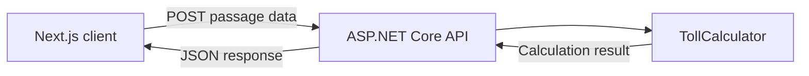

# Toll Fee Calculator – Implementation Plan

## Objective

The objective is to refactor the provided toll fee calculator into a
tested full-stack application with a clear separation between domain
logic, API, frontend and infrastructure.

The completed application will allow users to select a vehicle, add
toll passages and view the calculated daily toll fee through an
interactive visualization.

## Current state

The original implementation has been reorganized and partially
refactored.

Completed work:

- [x] Create a .NET solution and project structure
- [x] Separate models, interfaces, enums and services
- [x] Replace string-based vehicle types with `VehicleType`
- [x] Correct the 60-minute single-charge calculation
- [x] Sort passages chronologically before calculating the fee
- [x] Replace complex time conditions with named intervals
- [x] Simplify toll-free date handling
- [x] Add unit tests for toll calculation rules
- [x] Configure automated build and testing with GitHub Actions

## Planned architecture



## Planned repository structure

```text
/
├── src/
│   ├── TollFeeCalculator.Core/
│   └── TollFeeCalculator.Api/
├── tests/
│   └── TollFeeCalculator.Tests/
├── frontend/
│   └── toll-calculator-web/
├── docs/
│   └── implementation-plan.md
├── .github/
│   └── workflows/
└── WorkSamples.slnx
```

## API design

The frontend will communicate with the ASP.NET Core API through a
toll calculation endpoint.

### Request

```http
POST /api/toll/calculate
Content-Type: application/json
```

```json
{
  "vehicleType": "Car",
  "passages": [
    "2013-01-02T06:10:00",
    "2013-01-02T06:40:00",
    "2013-01-02T07:05:00"
  ]
}
```

### Response

```json
{
  "totalFee": 18
}
```

The response may later be expanded with a calculation breakdown to
support the frontend visualization.

## Frontend concept

The Next.js application will provide:

- vehicle type selection
- controls for adding and removing passages
- an animated vehicle passing a toll station
- a timeline showing passage times
- visual grouping of passages within the same 60-minute period
- an animated daily toll fee counter
- clear indication when the daily maximum fee is reached
- responsive and accessible interaction

## Implementation phases

### Phase 1 – Core domain and tests

- [x] Refactor the original calculation logic
- [x] Add unit tests
- [x] Add continuous integration

### Phase 2 – ASP.NET Core API

- [ ] Separate domain logic into `TollFeeCalculator.Core`
- [ ] Create `TollFeeCalculator.Api`
- [ ] Add request and response contracts
- [ ] Expose the calculation endpoint
- [ ] Add input validation
- [ ] Add API integration tests
- [ ] Configure CORS for local frontend development

### Phase 3 – Next.js frontend

- [ ] Create a Next.js application with TypeScript
- [ ] Configure Tailwind CSS
- [ ] Build the vehicle and passage controls
- [ ] Connect the frontend to the API
- [ ] Display calculation results
- [ ] Handle loading and error states

### Phase 4 – Visualization and animation

- [ ] Create the road and toll station scene
- [ ] Animate vehicle passages
- [ ] Create the passage timeline
- [ ] Animate changes to the total fee
- [ ] Respect reduced-motion accessibility preferences

### Phase 5 – Azure deployment

- [ ] Deploy the ASP.NET Core API to Azure App Service
- [ ] Deploy the frontend to Azure Static Web Apps
- [ ] Configure production environment variables
- [ ] Add Application Insights
- [ ] Configure deployment through GitHub Actions

### Phase 6 – Optional experimentation

- [ ] Evaluate Optimizely access and licensing
- [ ] Add a meaningful feature flag or interface experiment
- [ ] Document the experiment and its purpose

## Quality goals

- Business rules should remain independent of infrastructure.
- Public behavior should be covered by automated tests.
- The solution should build and test automatically on every push.
- API contracts should be explicit and validated.
- The frontend should be responsive and accessible.
- Secrets must not be committed to the repository.
- Commits should remain focused and descriptive.

## Design considerations

The current vehicle model follows the categories provided by the
original assignment. A possible future improvement is to separate the
physical vehicle type from its exemption status, since an emergency or
military designation describes the vehicle's use rather than its
physical type.

Optimizely will only be integrated if it contributes a genuine feature,
such as a feature flag or user-interface experiment. It will not be
added solely as a listed dependency.